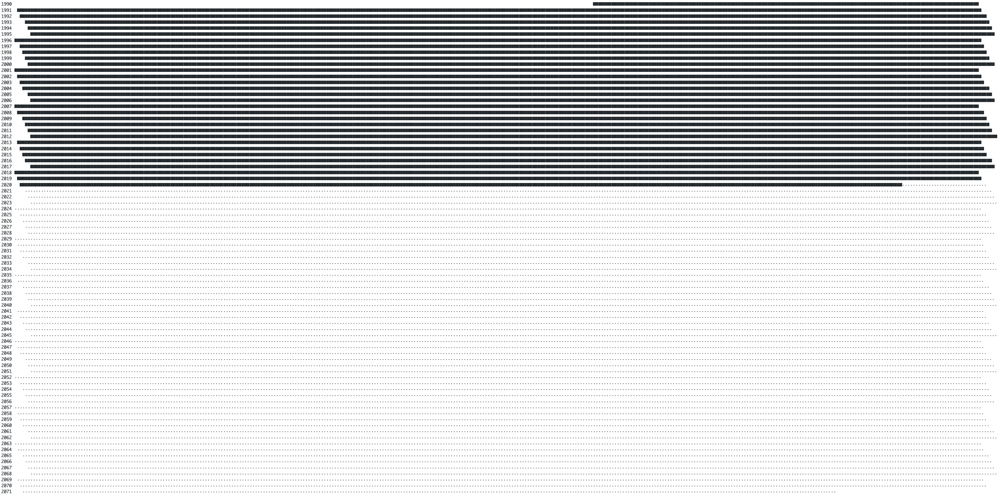

# Memento Mori Geeklet

This is a slightly depressing geeklet but at the same a very motivating one. If you are the type of person who is motivated by deadlines then you'll find this Geeklet very useful. It's aimed at reminding you of the ultimate deadline.

> Remembering that I may be dead soon is the most important tool I ever encountered to make the big choices in life. ~Steve Jobs

This script draws a character for every day you have lived. A line of these characters is a year of your life. It doesn't stop at the present day. Given the average life expectancy for your country and your gender (you can get them from [Wikipedia](https://en.wikipedia.org/wiki/List_of_countries_by_life_expectancy)), the script calculates how much time you got left and draws out your projected life span.

This Geeklet is designed to be run from [GeekTool](https://www.tynsoe.org/v2/geektool) but you can also invoke it from any terminal as long it supports the characters printed by the script.